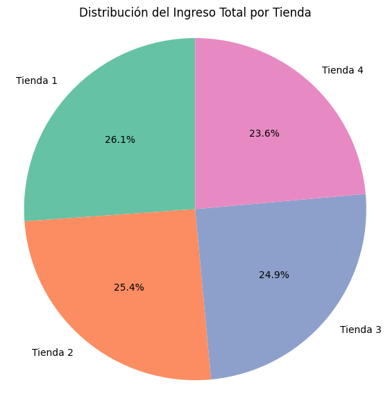
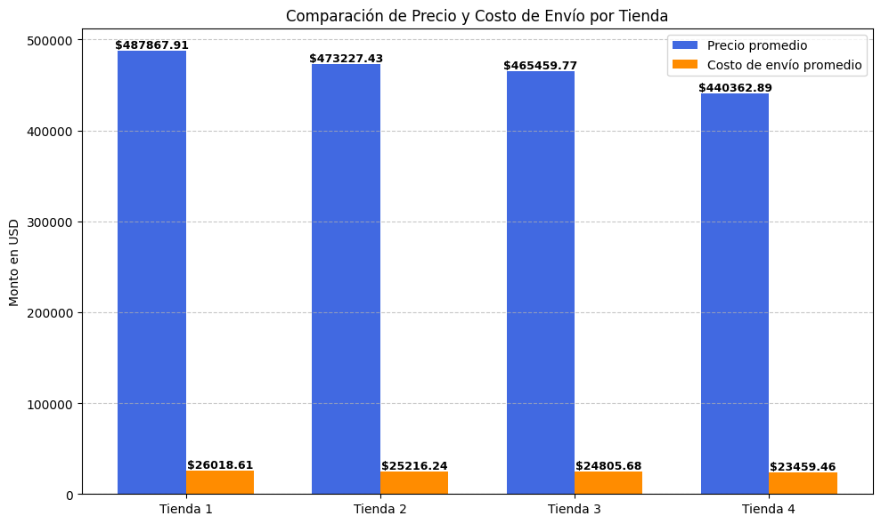
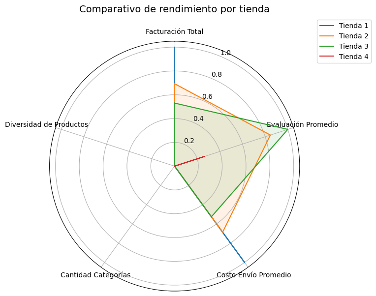

# 🏪 Alura Store Challenge

Este proyecto analiza el rendimiento de las 4 tiendas de la cadena Alura Store para ayudar al Sr. Juan a tomar una decisión estratégica: vender la tienda menos eficiente y reinvertir en un nuevo emprendimiento.

## 🎯 Objetivo
Identificar la tienda menos rentable basándose en:
- 💰 Ingresos totales
- 🌟 Reseñas de clientes
- 🚚 Tiempo promedio de envío
- 🛒 Categorías y productos más vendidos
- 🌍 Distribución geográfica de ventas (extra opcional)

## 🧰 Tecnologías utilizadas
- Python 3.x
- Pandas
- Matplotlib
- Seaborn
- Folium (para mapas interactivos)
- Jupyter Notebook / Google Colab

## 🚀 Estructura del repositorio

El proyecto está organizado para facilitar la navegación, el análisis y la reutilización del código. Cada carpeta tiene un propósito específico:

| Carpeta / Archivo     | Descripción                                                  |
|-----------------------|--------------------------------------------------------------|
| `data/`               | Archivos CSV con los datos de ventas por tienda              |
| `notebooks/`          | Notebook principal con el análisis completo                  |
| `src/`                | Funciones auxiliares y scripts de visualización              |
| `images/`             | Gráficos exportados para el README y presentaciones          |
| `README.md`           | Documentación del proyecto                                   |
| `requirements.txt`    | Lista de dependencias necesarias para ejecutar el proyecto   |

## 📊 Resultados esperados
- Mínimo 3 tipos de gráficos: barras, circular, dispersión
- Visualizaciones enriquecidas con anotaciones y comparaciones
- Conclusión ejecutiva con recomendación clara
- Análisis opcional de desempeño geográfico con mapas de calo

## 📷 Visualizaciones destacadas
### Ingresos totales por tienda

### Distribución del costo de envío por tienda

📌 Conclusión del análisis
Se recomienda vender Tienda 4, ya que presenta el rendimiento más débil en facturación, costos de envío y dominancia de categoría. Esta decisión permite optimizar recursos y fortalecer las tiendas con mayor potencial.

## ✍️ Autor
Jacqueline Rioja
Desafío Alura LATAM – Data Analysis
Diseñadora de soluciones analíticas con enfoque visual, estratégico y colaborativo.
